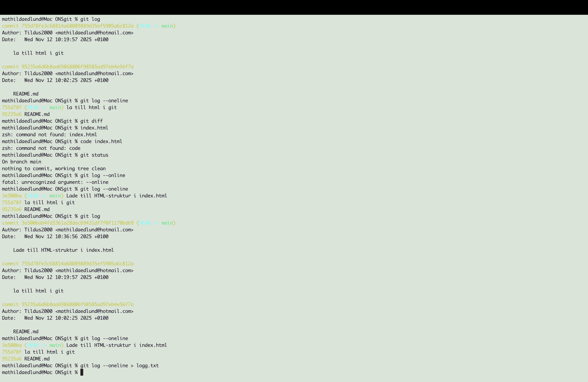

Mitt första repo - träning

Hej detta är mitt första repo på Github, jag har gjort Johans 6 lektioner och övat på grunderna i git, HTML och VS code

Exemempel på kod + bild i index.html:

Tjabba tjena hallå
<!DOCTYPE html>
<html lang="sv">
<head>
  <meta charset="UTF-8">
  <title>Min första sida</title>
</head>
<body>
  <h1>Hej världen!</h1>
  
Jag testar Git.

</body>
   
 nu testar jag en ny branch som heter test

</html>